# 饿了么 SpringBoot 项目任务书

## 一、项目基本信息
1. 项目名称：饿了么 SpringBoot 项目
2. 项目学时：2 天（12 学时）
3. 适用专业：计算机类，软件工程类、物联网类、智能科学与技术等

## 二、教学目的和基本要求
1. 强化对基于 SpringBoot+MyBatis+Vue 前后端分离项目的需求分析、系统设计、编码和调试能力。
2. 掌握对复杂程序的模块划分、数据结构定义、模块接口设计、模块流程设计的能力。
3. 具备一定的设计和实施程序实验以及对实验结果进行分析能力。
4. 具有主动获取知识能力和意识及独立解决问题的能力，掌握通过查阅参考书目、开发环境联机帮助、互联网检索等方法，获取前端应用开发相关知识及其他相关知识和技术。
5. 具备初步的工程技术文档写作能力。

## 三、课时安排
实践工作量满足 12 学时，对于学时分配如下：
| 项目阶段         | 学时 |
| ---------------- | ---- |
| 需求分析         | 1    |
| 系统设计         | 1    |
| 系统实现         | 5    |
| 测试、整合与部署 | 5    |

## 四、考核内容

### 4.1 考核方法与成绩评定
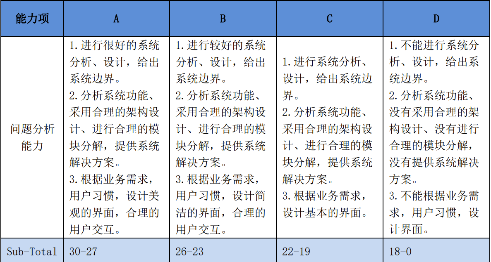
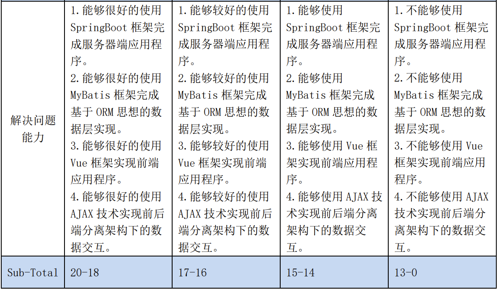
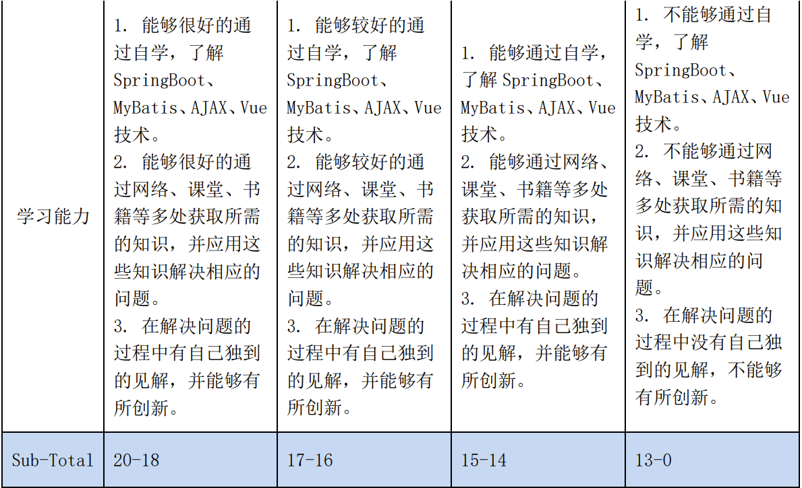
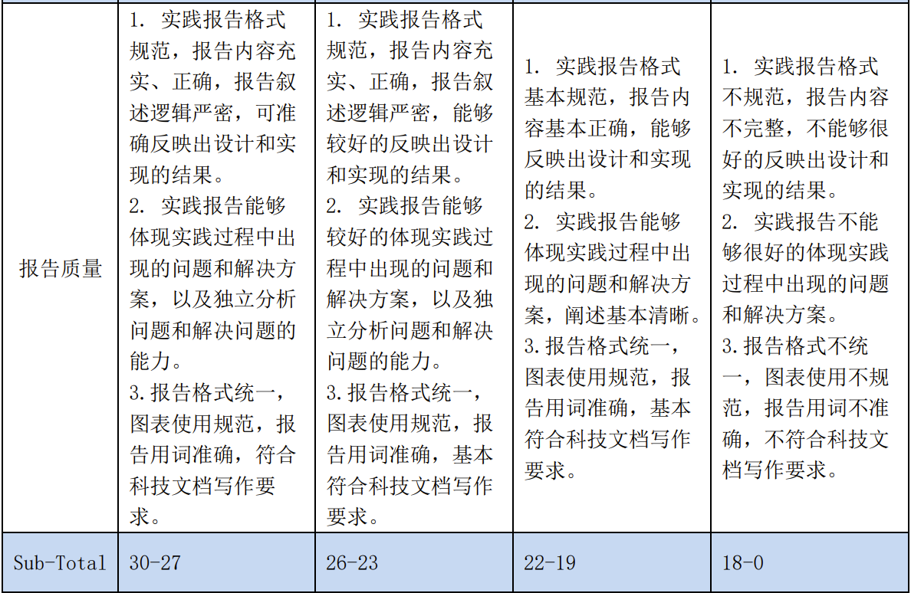

### 4.2 项目成果物提交
1. 实践报告（一份、A4 纸打印，同时包括一份电子文档）
2. 源程序文档（电子方式提交），源程序代码要求适当缩进编排、结构清晰、可读性好，对源程序的类说明、函数说明、接口说明、关键变量说明等要进行注释。
3. 答辩报告（制作 PPT 报告，电子方式提交），要求重点突出，思路清晰，同时就此报告准备答辩。

所有电子方式提交的文件全部存放在一个目录中，并对其进行压缩，压缩后的文件按规定格式进行命名，命名格式为：班级号＋学号＋姓名。

## 五、项目内容
本项目完成后，学员将能够使用 VUE+SpringBoot+AJAX 技术开发前后端分离的 Web 应用程序。

### 5.1 整体要求
1. 项目技术架构
   - Jdk8
   - SpringBoot
   - MyBatis
   - MySql
   - Vue
2. 开发工具
   - Hbuilder
   - STS（SpringToolSuite4）
   - mysql-5.5.62-winx64
   - Tomcat8.5
   - Maven
3. 涉及的技术点
   - AJAX 的使用
   - SpringBoot 框架的使用
   - MyBatis 框架的使用
   - 封装 Mapper
   - Service 层事务管理
   - 数据层层批量操作
   - 多对一与一对多的映射
   - 服务器端 json 数据转换
   - VueCli 的使用
   - 多条件模糊查询的使用

### 5.2 功能要求

#### 业务流程图
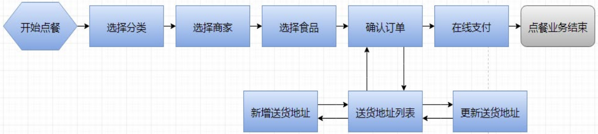

#### 1、首页功能：
首页
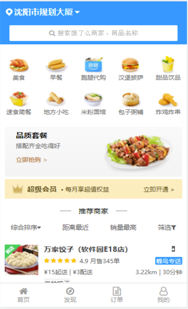

主要功能：
1. 显示点餐分类信息

动作：
1. 点击点餐分类小图片，跳转到商家列表页面
2. 点击下方菜单栏中的“订单”，跳转到历史订单页面

#### 2、商家列表页面功能：
商家列表页面

主要功能：
1. 根据点餐分类显示商家列表信息
2. 如果处于登录状态，那些需要查询购物车中是否有此商家的食品。如果有，在页面上显示食品数量

动作：
1. 点击某个商家，跳转到此商家的详细信息页面

#### 3、商家详细信息页面功能：
商家详细信息页面
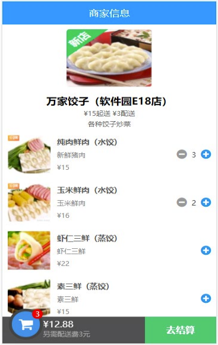

主要功能：
1. 显示商家详细信息及所属食品信息，并自动计算总价

动作：
1. 点击某食品的 + 按钮，食品数量加 1
2. 点击某食品的 - 按钮，食品数量减 1
3. 点击“去结算”按钮，跳转到确认订单页面
4. 如果没有登录，那么上述三个动作会自动跳转到登录页面

#### 4、确认订单页面功能：
确认订单页面
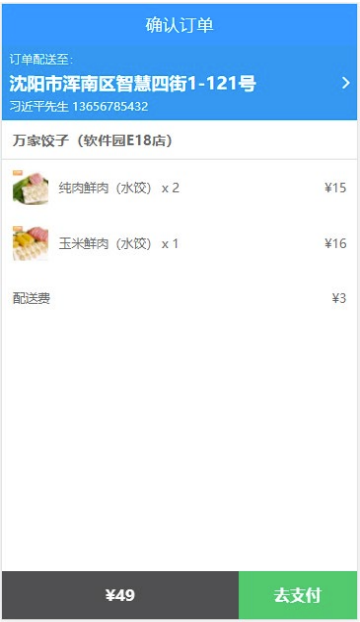

主要功能：
1. 确认订单信息是否正确
2. 选择送货地址

动作：
1. 点击送货地址，跳转到送货地址列表页面
2. 点击“去支付”按钮，生成订单后，跳转到支付页面

#### 5、在线支付页面功能：
在线支付页面
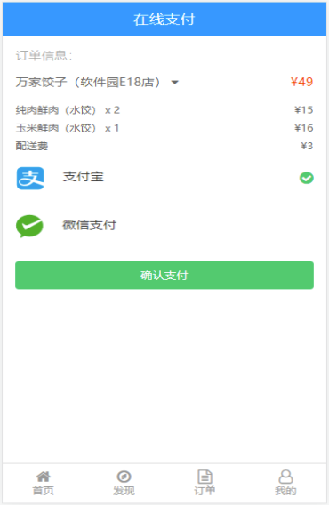

主要功能：
1. 显示订单信息及订单明细信息

动作：
1. 无（点餐业务流程到此结束）

#### 6、送货地址列表页面功能：
送货地址页面
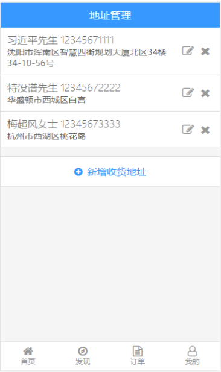

主要功能：
1. 显示当前用户的送货地址信息

动作：
1. 点击某个送货地址，跳转回确认订单页面
2. 点击“新增”按钮，跳转到新增送货地址页面
3. 点击“编辑”按钮，跳转到送货地址编辑页面
4. 点击“删除”按钮，删除此送货地址

#### 7、新增送货地址页面功能：
新增送货地址页面

主要功能：
1. 添加新的送货地址

动作：
1. 点击“保存”按钮，添加新的送货地址，并跳转到送货地址列表页面

#### 8、编辑送货地址页面功能：
编辑送货地址页面

主要功能：
1. 编辑送货地址

动作：
1. 点击“更新”按钮，保存编辑后的送货地址，并跳转到送货地址列表页面

#### 9、登录页面功能：
登录页面
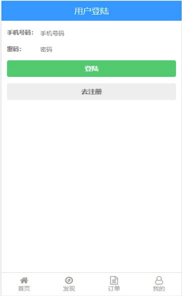

主要功能：
1. 用户登录

动作：
1. 点击“登陆”按钮，进行登陆业务处理。如果登陆成功，跳转到上一个页面
2. 点击“去注册”按钮，跳转到注册页面

#### 10、注册页面功能：
注册页面

主要功能：
1. 注册新用户

动作：
1. 点击“注册”按钮，进行新用户注册。注册成功后，跳转到登陆页面

#### 11、历史订单页面功能：
历史订单页面
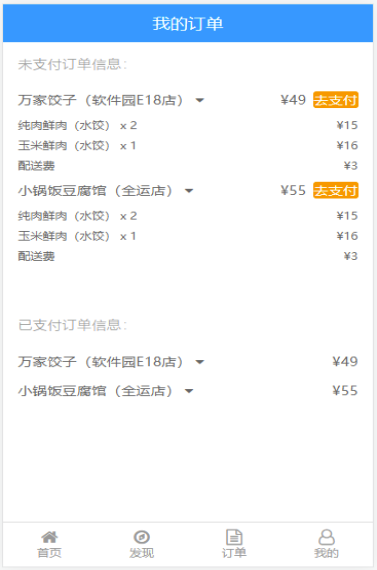

主要功能：
1. 显示用户历史订单信息

动作：
1. 点击某个历史订单，可以对订单明细信息进行显示和隐藏

### 5.3 实施流程

#### 5.3.1 服务器端实施流程
1. 在 MySql 数据库中创建 elm 数据库
2. 创建 SpringBoot 工程
3. 创建 SpringBoot 工程配置文件
4. 创建 ElmbootApplication 主启动类
5. 创建 WebMvcConfig 配置类解决跨域问题
6. 根据业务创建 Mapper 层组件
7. 根据业务创建 Service 层组件
8. 根据业务创建 Controller 层组件
9. 启动服务器端项目

#### 5.3.2 前端实施流程
1. 创建 Vue-Cli 工程
2. 添加依赖：axios、qs、font-awesome
3. 添加自定义模块：common.js
4. 创建 Vue-Cli 配置文件，并添加配置信息
5. 根据业务创建所需 Vue 组件
6. 为 Vue 组件设置路由
7. 启动前端服务

## 六、附录：数据库设计参考

### 数据库设计一览表
| No  | 表名称          | 中文名     | 说明                               |
| --- | --------------- | ---------- | ---------------------------------- |
| 1   | business        | 商家表     | 存储所有商家信息                   |
| 2   | food            | 食品表     | 存储每个商家所拥有的所有食品信息   |
| 3   | cart            | 购物车表   | 存储每个用户的购物车中的食品信息   |
| 4   | deliveryaddress | 送货地址表 | 存储每个用户的所有送货地址信息     |
| 5   | orders          | 订单表     | 存储每个用户的所有订单信息         |
| 6   | orderdetailet   | 订单明细表 | 存储每个订单中所订购的所有食品信息 |
| 7   | user            | 用户表     | 存储所有用户信息                   |

### 1、 business（商家表）
| No  | 字段名          | 数据类型   | size  | 默认值 | 约束       | 说明     |
| --- | --------------- | ---------- | ----- | ------ | ---------- | -------- |
| 1   | businessId      | int        |       |        | PK、AI、NN | 商家编号 |
| 2   | businessName    | varchar    | 40    |        | NN         | 商家名称 |
| 3   | businessAddress | varchar    | 50    |        |            | 商家地址 |
| 4   | businessExplain | varchar    | 40   |        |            | 商家介绍 |
| 5   | businessImg     | mediumtext |       |        | NN         | 商家图片 |
| 6   | orderTypeId     | int        |       |        | NN         | 点餐分类 |
| 7   | starPrice       | decimal    | (5,2) | 0.00   |            | 起送费   |
| 8   | deliveryPrice   | decimal    | (5,2) | 0.00   |            | 配送费   |
| 9   | remarks         | varchar    | 40    |        |            | 备注     |

### 2、 food（食品表）
| No  | 字段名      | 数据类型   | size  | 默认值 | 约束       | 说明         |
| --- | ----------- | ---------- | ----- | ------ | ---------- | ------------ |
| 1   | foodId      | int        |       |        | PK、AI、NN | 食品编号     |
| 2   | foodName    | varchar    | 30    |        | NN         | 食品名称     |
| 3   | foodExplain | varchar    | 30   |        | NN         | 食品介绍     |
| 4   | foodImg     | mediumtext |       |        | NN         | 食品图片     |
| 5   | foodPrice   | decimal    | (5,2) |        | NN         | 食品价格     |
| 6   | businessId  | int        |       |        | FK、NN     | 所属商家编号 |
| 7   | remarks     | varchar    | 40    |        |            | 备注         |

### 3、 cart（购物车表）
| No  | 字段名     | 数据类型 | size | 默认值 | 约束       | 说明                   |
| --- | ---------- | -------- | ---- | ------ | ---------- | ---------------------- |
| 1   | cartId     | int      |      |        | PK、AI、NN | 无意义编号             |
| 2   | foodId     | int      |      |        | FK、NN     | 食品编号               |
| 3   | businessId | int      |      |        | FK、NN     | 所属商家编号           |
| 4   | userId     | varchar  | 20   |        | FK、NN     | 所属用户编号           |
| 5   | quantity   | int      |      |        | NN         | 同一类型食品的购买数量 |

### 4、 deliveryaddress（送货地址表）
| No  | 字段名      | 数据类型 | size | 默认值 | 约束       | 说明         |
| --- | ----------- | -------- | ---- | ------ | ---------- | ------------ |
| 1   | daId        | int      |      |        | PK、AI、NN | 送货地址编号 |
| 2   | contactName | varchar  | 20   |        | NN         | 食品编号     |
| 3   | contactSex  | int      |      |        | NN         | 联系人性别   |
| 4   | contactTel  | varchar  | 20   |        | NN         | 联系人电话   |
| 5   | address     | varchar  | 100  |        | NN         | 送货地址     |
| 6   | userId      | varchar  | 20   |        | FK、NN     | 所属用户编号 |

### 5、 orders（订单表）
| No  | 字段名     | 数据类型 | size  | 默认值 | 约束       | 说明                             |
| --- | ---------- | -------- | ----- | ------ | ---------- | -------------------------------- |
| 1   | orderId    | int      |       |        | PK、AI、NN | 订单编号                         |
| 2   | userId     | varchar  | 20    |        | FK、NN     | 所属用户编号                     |
| 3   | businessId | int      |       |        | FK、NN     | 所属商家编号                     |
| 4   | orderDate  | varchar  | 20    |        | NN         | 订购日期                         |
| 5   | orderTotal | decimal  | (7,2) | 0.00   | NN         | 订单总价                         |
| 6   | daId       | int      |       |        | FK、NN     | 所属送货地址编号                 |
| 7   | orderState | int      |       | 0      | NN         | 订单状态（0：未支付，1：已支付） |

### 6、 orderdetailet（订单明细表）
| No  | 字段名   | 数据类型 | size | 默认值 | 约束       | 说明         |
| --- | -------- | -------- | ---- | ------ | ---------- | ------------ |
| 1   | odId     | int      |      |        | PK、AI、NN | 订单明细编号 |
| 2   | orderId  | int      |      |        | FK、NN     | 所属订单编号 |
| 3   | foodId   | int      |      |        | FK、NN     | 所属食品编号 |
| 4   | quantity | int      |      |        | NN         | 数量         |

### 7、 user（用户表）
| No  | 字段名   | 数据类型   | size | 默认值 | 约束   | 说明                         |
| --- | -------- | ---------- | ---- | ------ | ------ | ---------------------------- |
| 1   | userId   | varchar    | 20   |        | PK、NN | 用户编号                     |
| 2   | password | varchar    | 20   |        | NN     | 密码                         |
| 3   | userName | varchar    | 20   |        | NN     | 用户名                       |
| 4   | userSex  | int        |      | 1      | NN     | 用户性别（1：男，0：女）     |
| 5   | userImg  | mediumtext |      |        |        | 用户头像                     |
| 6   | delTag   | int        |      | 1      | NN     | 删除标记（1：正常，0：删除） |

